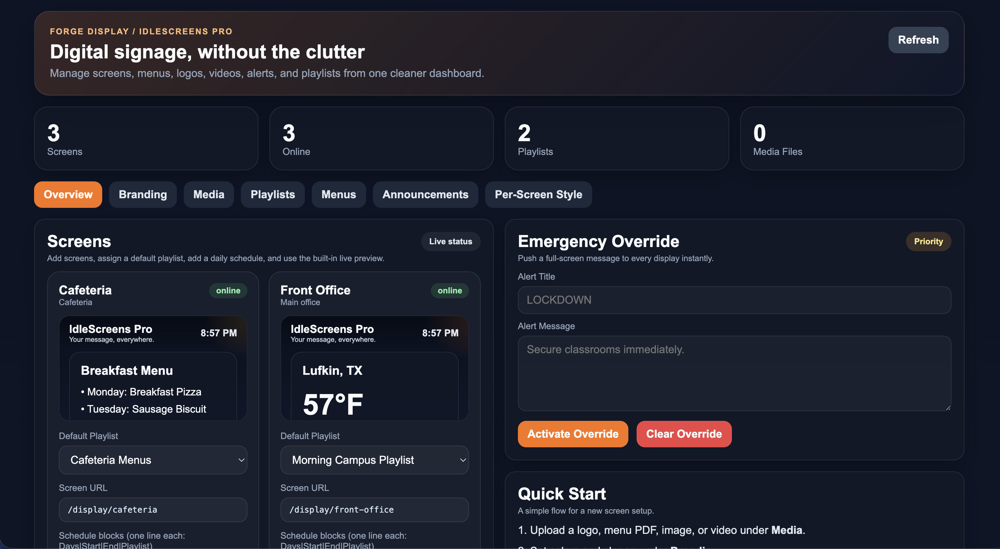
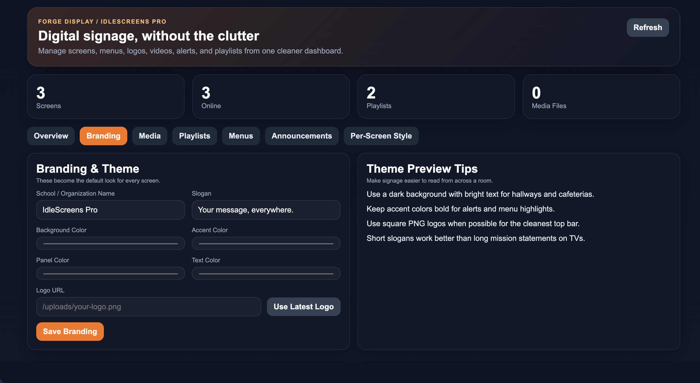
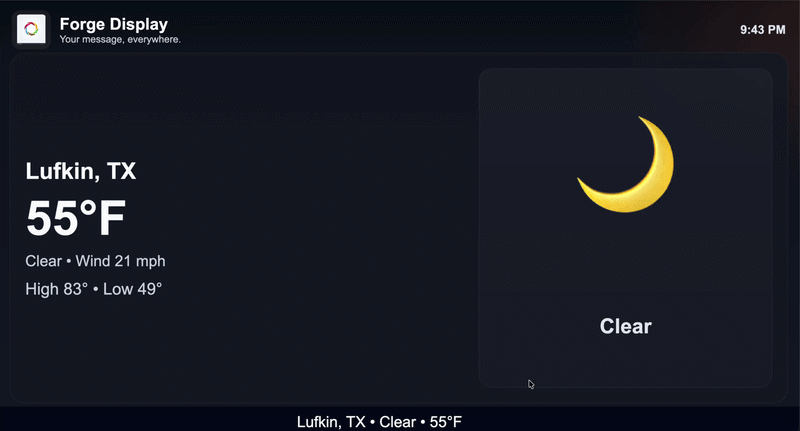

# Forge Display


**Forge Display** is a **self‑hosted digital signage platform** designed for **schools, churches, gyms, coffee shops, and small businesses**.

It allows you to control multiple screens from a central web dashboard and display dynamic content such as:

- Weather
- Announcements
- Menus
- Calendars
- Videos
- RSS feeds
- Sports scores
- Emergency alerts

Forge Display is built to be **simple to deploy, easy to manage, and affordable to run**.

---

# Features

## Central CMS

Manage all screens from a single web interface.

---

## Multi‑Screen Support

Control TVs, browsers, or Raspberry Pi displays across your building or campus.

Supported display devices:

- Smart TVs
- Raspberry Pi kiosks
- Mini PCs
- Web browsers
- Digital signage displays

---

## Live Screen Preview

See a **live thumbnail preview** of every screen from the admin dashboard.

This makes it easy to verify:

- correct playlists
- working screens
- screen health

---

## Scheduled Playlists

Automatically switch playlists based on time of day.

Example schedule:

```
Mon-Fri | 06:00 | 09:30 | Breakfast Menu
Mon-Fri | 09:30 | 15:30 | Campus Announcements
Mon-Fri | 15:30 | 18:00 | Sports & Events
```

---

## Media Uploads

Upload and display media directly from the CMS.

Supported media:

- Images
- Videos
- PDFs
- Logos

---

## Built‑In Widgets

Forge Display includes several widgets out of the box:

- Weather (Fahrenheit)
- Announcements
- RSS feeds
- School calendars
- Sports scores
- Breakfast menu
- Lunch menu
- PDF menu display

---

## Crawlers with Speed Control

Scrolling crawlers support **adjustable speed settings**.

Example use cases:

- RSS headlines
- campus announcements
- event reminders
- emergency notices

---

## Branding Controls

Customize displays with:

- organization logo
- organization name
- slogan
- background colors
- theme colors

Perfect for school or business branding.

---

## Emergency Override

Push emergency alerts to every screen instantly.

Example uses:

- lockdown alerts
- weather alerts
- emergency notifications

---

## Appliance‑Style Install

Forge Display installs as a **system service** and automatically starts on boot.

No container orchestration required.

---

# Screenshots

*(Add screenshots to `/docs/screenshots` and they will appear here.)*

### Admin Dashboard


### Playlist Editor



### Weather Widget



### Menu Display


---

# Animated Demo

Example signage screen:



*(Replace with a screen recording GIF once available.)*

---

# Installation

Forge Display installs in minutes.

## Recommended Installation

```bash
git clone https://github.com/kmce2019/forge-display.git
cd forge-display
sudo bash install.sh
```

The installer will automatically:

- install Node.js if needed
- install required dependencies
- configure SQLite
- install the Forge Display service
- start the application

---

# Access the Admin Panel

After installation:

```
http://SERVER-IP:3010/admin
```

Example:

```
http://192.168.1.50:3010/admin
```

---

# Display Screens

Each display connects using a simple URL.

Example:

```
http://SERVER-IP:3010/display/front-office
```

This URL can be opened on:

- Smart TVs
- Browsers
- Raspberry Pi kiosks
- Mini PCs

---

# Running as a Service

Forge Display installs a system service named:

```
idlescreens-pro
```

Useful commands:

```bash
sudo systemctl status idlescreens-pro
sudo systemctl restart idlescreens-pro
sudo journalctl -u idlescreens-pro -f
```

---

# Updating Forge Display

To update the application:

```bash
cd forge-display
git pull
npm install
sudo systemctl restart idlescreens-pro
```

---

# Roadmap

Planned improvements:

- drag‑and‑drop layout builder
- screen grouping
- ad rotation / sponsorship slides
- user accounts and permissions
- analytics and screen uptime
- Raspberry Pi auto‑provisioning
- remote updates
- cloud sync option

---

# Use Cases

Forge Display works well for:

## Schools

- announcements
- lunch menus
- weather
- bell schedule
- sports scores

## Churches

- service countdowns
- announcements
- events

## Gyms

- class schedules
- announcements
- promotions

## Coffee Shops / Restaurants

- menu boards
- specials
- social feeds

---

# License

MIT License

---

# Contributing

Pull requests and ideas are welcome.

If you find a bug or want a feature added, open an issue.

---

# Author

Kevin Gardner  
IT Director  
East Texas

---

# Future Product Direction

Forge Display is being developed as a **self‑hosted alternative to expensive digital signage platforms**, focused on simplicity and real‑world deployments.
